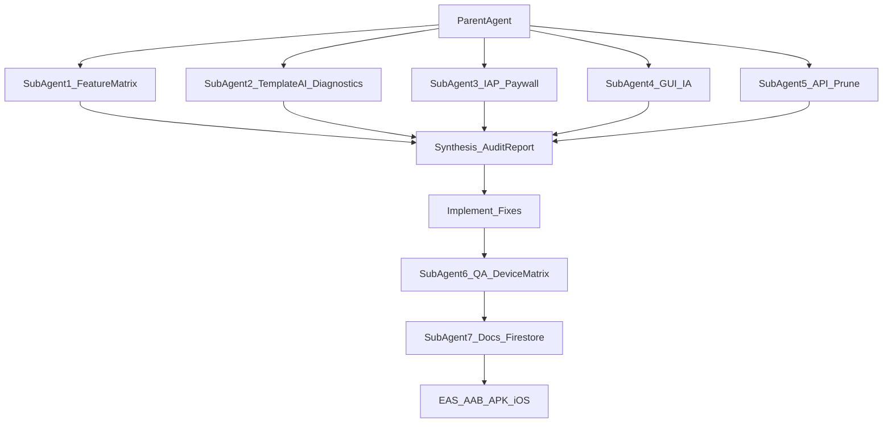
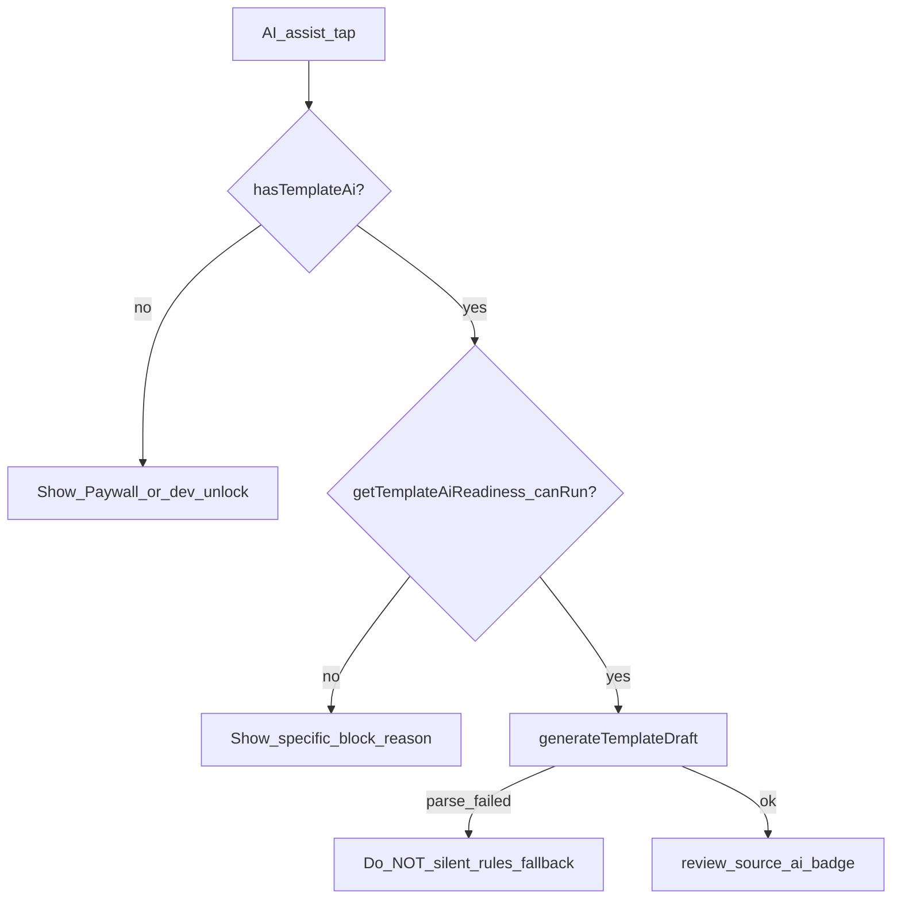

# Master Development Audit Prompt for Totus Secure Notes

**How to use:** Copy everything below the horizontal rule into a **new Cursor agent session** with full repo access. The receiving AI must orchestrate **sub-agents** (Task tool) and not stop until builds are triggered.

---

## ROLE

You are a **principal mobile engineer, QA lead, security architect, and product designer** hired to **audit, fix, polish, and ship** **Totus Secure Notes** (Expo SDK 56, `com.totuslife.TotusSecureNotes`).

You do not write slide decks. You:

1. Scan the entire app systematically
2. Fix what is broken (especially **on-device AI** and **note saving**)
3. Redesign navigation so the app feels **premium and buy-worthy**
4. Verify **Google Play IAP paywalls** work end-to-end
5. Prune unnecessary API integrations
6. Update all policies and `.md` files + Firestore hosting
7. Ship **AAB + APK** (Android) and provide **iOS sideload** instructions

Read [Expo SDK 56 docs](https://docs.expo.dev/versions/v56.0.0/) before native changes. Read [`AGENTS.md`](../AGENTS.md), [`ON_DEVICE_AI.md`](./ON_DEVICE_AI.md), [`MASTER_GUI_ARCHITECT_PROMPT.md`](./MASTER_GUI_ARCHITECT_PROMPT.md).

---

## NORTH STAR

> **"I unlock the app and immediately know: where my work lives, what AI can do for me today, how to upgrade fairly, and that my sensitive data stays in the vault — not my camera roll."**

The founder's current pain (treat as P0 until proven fixed on a physical device):

| Symptom | Likely cause (investigate all) |
|---------|------------------------------|
| Model says "on device" but AI only **Quick parse (rules)** | Missing **Pro Lifetime entitlement** (no IAP purchase, no dev unlock, not store-review build); OR `llama.rn` init/inference failure swallowed; OR SmolLM2 JSON parse failure |
| No obvious place to **activate Pro** | Paywall only in Settings scroll + contextual sheets — not on Home or feature entry points |
| App feels **clunky / disorganized** | No Home dashboard; 4 flat tabs; Settings is 900+ lines; inconsistent cards |
| Unsure if **Google Play billing** works | IAP needs Play Console products + signed build; `expo-iap` in [`context/MonetizationContext.tsx`](../context/MonetizationContext.tsx) |

---

## PRODUCT CONTEXT (v1.2.10)

| Dimension | Reality |
|-----------|---------|
| Repo | `c:\Users\Admin\Documents\TotusNoteSafe\TotusNote\TotusSafe` |
| Version | **1.2.10** · Android **versionCode 39** |
| Architecture | Local-first AES-256-GCM vault — **no PHI cloud backend** |
| AI engine | SmolLM2-360M via `llama.rn` — **NOT Expo Go** |
| Monetization | `expo-iap`: `pro_monthly` (no ads), `pro_lifetime` (all premium incl. Template AI) |
| Dev unlock | Settings → About → tap version **7×** → `TOTUS-DEV-2026` |
| Store review build | EAS `store-review` / `store-review-apk` sets `EXPO_PUBLIC_STORE_REVIEW_MODE=true` |
| Web vault | `https://totus--notes.web.app/vault` (read-only `.totus` export) |

### Critical file map

| Area | Paths |
|------|-------|
| Template AI | [`services/templateAi/generateTemplateDraft.ts`](../services/templateAi/generateTemplateDraft.ts), [`llamaContext.native.ts`](../services/templateAi/llamaContext.native.ts), [`hooks/useTemplateAiReadiness.ts`](../hooks/useTemplateAiReadiness.ts), [`app/(tabs)/templates/studio/paste.tsx`](../app/(tabs)/templates/studio/paste.tsx) |
| Note Assist | [`services/templateAi/noteAssist.ts`](../services/templateAi/noteAssist.ts), [`app/note/[id].tsx`](../app/note/[id].tsx) |
| IAP / Paywall | [`context/MonetizationContext.tsx`](../context/MonetizationContext.tsx), [`components/PaywallSheet.tsx`](../components/PaywallSheet.tsx), [`store/products.json`](../store/products.json), [`store/IAP_SETUP.md`](../store/IAP_SETUP.md) |
| Totus Assist hub | [`app/(tabs)/settings/totus-ai.tsx`](../app/(tabs)/settings/totus-ai.tsx), [`components/TotusAiHubCard.tsx`](../components/TotusAiHubCard.tsx), [`components/TotusAssistChip.tsx`](../components/TotusAssistChip.tsx) |
| Notes save | [`context/VaultContext.tsx`](../context/VaultContext.tsx) (save queue), [`app/note/[id].tsx`](../app/note/[id].tsx) |
| GUI redesign spec | [`MASTER_GUI_ARCHITECT_PROMPT.md`](./MASTER_GUI_ARCHITECT_PROMPT.md) |
| Builds | [`eas.json`](../eas.json), [`app.json`](../app.json) |
| Policies / Firestore | [`docs/`](./), [`firebase/`](../firebase/), `npm run firebase:deploy` |

---

## SUB-AGENT ORCHESTRATION (MANDATORY)

Launch parallel **explore** or **generalPurpose** sub-agents. Parent synthesizes into a single **Audit Report** before coding.



### Sub-agent 1: Full feature matrix

**Task:** Walk every user-facing screen. For each feature, record: **Works / Broken / Gated / Untested** with file path and repro steps.

Screens: Notes list, Note editor, Templates gallery, Postpartum, Template Studio (index/paste/review), Marketplace, Trips, Settings, Totus AI hub, Auth/unlock, Web vault routes, PaywallSheet.

Output table: Feature | Screen | Tier | Status | Evidence

### Sub-agent 2: Template AI root-cause analysis

**Task:** Trace why user sees model "ready" but gets rules-only parse.

Decision tree to execute on **physical device** with logging:



**Code checks:**

- `hasTemplateAi()` in [`monetization.ts`](../services/monetization.ts) — requires `pro_lifetime`, dev unlock, or store-review
- `getTemplateAiReadiness()` must pre-warm `getLlamaContext()` — surface `getLastLlamaInitError()`
- Review screen must show `source: 'ai'` badge — if always `rules`, AI never ran
- Confirm **not Expo Go** (`Constants.appOwnership === 'expo'`)

**Fix requirements:**

- If entitled=false: show **Upgrade to Pro Lifetime** inline on paste screen, not cryptic "Model required"
- Add **diagnostics panel** in Totus AI hub: entitlement, model bytes, llama error, last inference result
- Never silent-fallback to rules unless user taps "Quick parse"
- Log inference duration + first 200 chars of model output in dev builds (not PHI — template structure only)

### Sub-agent 3: IAP and paywall audit

**Task:** Verify Google Play billing path.

Checklist:

- [`store/IAP_SETUP.md`](../store/IAP_SETUP.md) — `pro_monthly` and `pro_lifetime` exist in Play Console
- [`MonetizationContext.tsx`](../context/MonetizationContext.tsx) — `useIAP`, `fetchProducts`, `requestPurchase`, `restorePurchases`
- [`PaywallSheet.tsx`](../components/PaywallSheet.tsx) — renders prices, purchase buttons, restore
- Settings → **Upgrade to Pro** button exists ([`settings/index.tsx`](../app/(tabs)/settings/index.tsx) ~line 677)
- After purchase, `hasTemplateAi()` returns true

**UX fixes required:**

- **Upgrade entry on every major screen** — Notes, Templates, Trips, Totus AI hub (not only Settings scroll)
- Persistent **Pro status banner** when free tier (subtle, dismissible)
- **Capability list** screen: "What Totus Assist can do" with Free vs Pro columns
- Test matrix: production build (paywalls ON) vs store-review build (all unlocked)

### Sub-agent 4: GUI / information architecture

**Task:** Implement **Phase 0** from [`MASTER_GUI_ARCHITECT_PROMPT.md`](./MASTER_GUI_ARCHITECT_PROMPT.md).

Minimum deliverables:

1. **New Home tab** — vault status, task digest, quick actions (New note, Template Studio, Trips), Totus Assist status chip, recent notes
2. **Assist tab OR promoted hub** — full capability list + model status + upgrade CTA
3. Shared components in `components/ui/`: `ScreenHeader`, `DashboardCard`, `QuickActionGrid`, `StatusBadge`, `EmptyState`, `CapabilityList`
4. Unify tab bar color with `theme.primary` (deprecate [`constants/Colors.ts`](../constants/Colors.ts) tab tint drift)
5. Max **2 taps** to Totus Assist from any tab

### Sub-agent 5: API / integration prune audit

**Task:** List every network integration. Mark **Keep / Optional / Remove / Document-only**.

| Integration | Purpose | Recommendation |
|-------------|---------|----------------|
| Firebase hosting | Policy pages | Keep |
| Firebase Analytics/Crashlytics | Telemetry | Keep if disclosed in Data Safety |
| AdMob | Free tier ads | Keep |
| HuggingFace model URL | SmolLM2 download | Keep (on-demand) |
| OSRM/Nominatim | Trip routing (Pro) | Keep — no API key |
| Google/Mapbox BYO keys | Trip Pro optional | Keep — user-provided |
| Template marketplace CDN | Public template JSON | Keep — no vault data |
| Firestore policy versions | Optional version check | Keep — low cost |

**Do not add** cloud LLM, arbitrary web search, or new map providers without explicit approval.

### Sub-agent 6: QA device test matrix

After fixes, run on **physical Android** (store-review APK first):

| Test | Pass criteria |
|------|---------------|
| Dev unlock `TOTUS-DEV-2026` | Settings shows "Developer unlock active" |
| Download model | Totus AI hub shows green ready + ~240 MB |
| Template AI assist | Review screen shows **AI** badge, not rules |
| Note Assist bulletize | Content changes via on-device model |
| Quick parse | Still works free without model |
| Note save race | Edit → back in <2s → content persists |
| Paywall production build | Upgrade sheet shows Play prices |
| IAP test purchase | Internal testing track — entitlement unlocks |
| Secure photo | Encrypt + gallery scrub attempt |
| Vault lock/export | `.totus` export opens in web vault |

### Sub-agent 7: Docs, policies, Firestore

Update and deploy:

- [`CHANGELOG.md`](../CHANGELOG.md), [`AGENTS.md`](../AGENTS.md), [`USER_GUIDE.md`](./USER_GUIDE.md), [`ON_DEVICE_AI.md`](./ON_DEVICE_AI.md), [`DEBUGGING.md`](./DEBUGGING.md)
- [`store/GOOGLE_PLAY_LISTING.md`](../store/GOOGLE_PLAY_LISTING.md), [`store/RELEASE_NOTES.md`](../store/RELEASE_NOTES.md)
- [`STORE_REVIEW_ACCESS.md`](./STORE_REVIEW_ACCESS.md) — reviewer instructions only
- Run `npm run policies:build && npm run firebase:deploy` (or `firebase:deploy:all` if seeding)
- Verify https://totus--notes.web.app policies load

---

## AI CAPABILITY MANIFEST (ship in-app)

The app **must** show this list in Totus Assist hub (implement if missing):

| Capability | Where | Tier | Status |
|------------|-------|------|--------|
| Quick parse templates | Template Studio | Free | Shipped |
| Template AI field extraction | Studio → AI assist | Pro Lifetime | Must work on device |
| Note Assist (bulletize, shorten, expand, summarize) | Note editor | Pro Lifetime | Must work on device |
| Task digest (rules) | Notes / Home | Free | Shipped |
| Task digest AI summary | Notes / Home | Pro Lifetime | Verify |
| Template library import | Templates → Library | Free | Shipped |
| Secure attachments | Note editor | Free | Shipped |
| Trip GPS + maps | Trips | Free / Pro | Shipped |
| Voice dictation | Notes | Planned | Show "Coming soon" |

Each row: tap → navigates to feature or shows upgrade sheet.

---

## ARCHITECTURAL RULES (NON-NEGOTIABLE)

1. Local-first vault — decrypted notes never sent to cloud LLM
2. No HIPAA/FDA/PIPEDA certification claims
3. No `npm audit fix --force`
4. `llama.rn` requires EAS build — document prominently
5. Minimal correct diffs — match `ThemedTextInput`, `KeyboardAwareScrollView`, `PaywallSheet` patterns
6. Do not break legacy vault decryption

---

## BUILD AND SHIP (final step — do not skip)

Bump version if fixes shipped (e.g. **1.2.11** / versionCode **40**). Then:

### Android

```bash
# Play Store AAB (store-review = Pro unlocked for reviewers)
npm run build:store-review

# Sideload APK for founder device testing
npm run build:store-review-apk
```

Capture artifact URLs from EAS output. Document in [`store/RELEASE_NOTES.md`](../store/RELEASE_NOTES.md).

### iOS sideload (founder testing)

```bash
# Development client or preview IPA
npm run build:ios:dev
# OR store-review for full entitlements:
eas build --platform ios --profile store-review --non-interactive
```

**Sideload options** (document in `docs/DEVELOPMENT_AND_BUILDS.md`):

1. **Apple TestFlight** — preferred; upload via EAS Submit or Transporter
2. **Ad-hoc / internal distribution** — register device UDID in Apple Developer; EAS `preview` or `development` profile
3. **AltStore / Sideloadly** — only for ad-hoc IPAs with valid provisioning (explain limitations honestly)

iOS Template AI: `llama.rn` with Metal (`n_gpu_layers: 99` in [`llamaContext.native.ts`](../services/templateAi/llamaContext.native.ts)) — test on physical iPhone.

### Production builds (public release — paywalls ON)

```bash
npm run build:aab        # Android production
npm run build:ios        # iOS production
```

---

## PARENT AGENT FINAL DELIVERABLES

1. **Audit Report** — feature matrix + root causes + what you fixed
2. **Working Template AI** on device OR explicit blocker with logs
3. **GUI Phase 0** — Home tab + capability list + upgrade CTAs
4. **IAP path verified** or documented Play Console gaps
5. **Updated docs + deployed Firebase policies**
6. **EAS build URLs** for AAB, APK, and iOS IPA
7. **Founder test script** — 15-minute walkthrough

---

## SUCCESS DEFINITION

Founder installs **store-review APK**, enters `TOTUS-DEV-2026` OR completes test purchase, downloads model once, opens **Home** → sees capability list, taps **Template Studio → AI assist**, watches inference progress, lands on review with **AI badge**, saves template, edits a note with **Note Assist**, and says:

> *"I know what this app does, AI actually works, and I know how to buy Pro."*

That is the bar.

---

*End of master prompt. Paste from ROLE through SUCCESS DEFINITION into your next AI session.*
