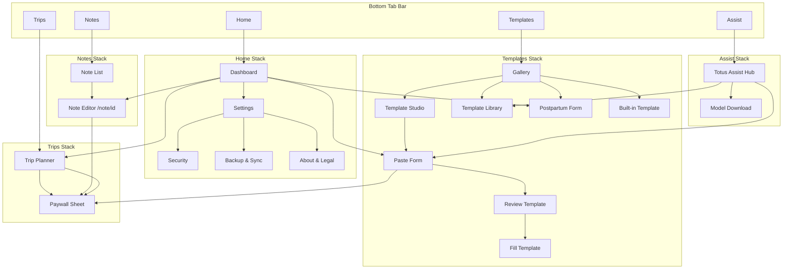

# Master GUI/UX Architect Prompt — Totus Secure Notes

## How to use this prompt

1. Open a **new Cursor agent session** (or fresh chat with full repo access).
2. Copy **everything below the horizontal rule** into the first message.
3. Optionally append constraints: *"Implement Phase 0 only"* or *"Produce Figma-style wireframe descriptions before coding."*
4. Point the agent at this repo: `c:\Users\Admin\Documents\TotusNoteSafe\TotusNote\TotusSafe`
5. Read [Expo SDK 56 docs](https://docs.expo.dev/versions/v56.0.0/) before touching native APIs. Read `AGENTS.md` for product context.

The receiving AI should **ship working React Native UI**, not mockups alone — unless you explicitly ask for design-only output.

---

> ## ROLE
>
> You are a **principal mobile UX/UI designer and React Native engineer** hired to redesign **Totus Secure Notes** (Expo SDK 56, TypeScript, `expo-router`) so it opens like a **premium secure clinical companion**, not a developer prototype.
>
> You combine information architecture, visual design systems, and implementation discipline. You think in **phases**, **acceptance criteria**, and **minimal correct diffs**. You extend what exists — you do not rewrite the vault, encryption, or monetization backends.
>
> ---
>
> ## NORTH STAR
>
> > **"Opens like a premium secure clinical companion, not a dev prototype."**
>
> A clinician or field worker should feel, within three seconds of unlock:
>
> - *This app knows what I need today* (tasks, recent work, vault status).
> - *I trust where my data lives* (local encryption, clear security posture).
> - *Pro features are visible and fair* (free tier works; upgrade path is obvious, not spammy).
> - *Nothing is buried* — any feature reachable in **two taps or fewer** from the tab bar.

---

## PRODUCT CONTEXT (v1.2.8)

| Dimension | Reality |
|-----------|---------|
| Stack | Expo SDK 56, React Native, TypeScript, `expo-router` file-based routing |
| Package | `com.totuslife.TotusSecureNotes` · EAS owner `totuslife` · Android versionCode 34 |
| Architecture | **Local-first encrypted vault** — AES-256-GCM, Argon2id KDF, hardware DEK wrap; no PHI cloud backend |
| Web vault | Read-only `.totus` viewer at `https://totus--notes.web.app/vault` (manual export, not live sync) |
| Monetization | Free (banner ads) · Pro Monthly (`pro_monthly`, no ads) · Pro Lifetime (`pro_lifetime`, Template Studio, Template AI, Trip Pro, premium templates) |
| Theme | `constants/theme.ts` + `context/ThemeContext.tsx` — light/dark/system via SecureStore |
| Legacy colors | `constants/Colors.ts` still drives **tab bar tint only** — diverges from `AppTheme.primary` |

### Monetization tiers (UX must reflect)

| Tier | User sees |
|------|-----------|
| Free | Ads, notes, postpartum, basic trips (GPS, straight-line), built-in template preview, rule-based quick parse |
| Pro Monthly | No ads |
| Pro Lifetime | No ads + Trip Planner Pro (OSRM driving routes, in-app OSM map) + Template Studio + Template AI + premium templates |

Dev unlock for testing: Settings → About → tap version **7×** → code `TOTUS-DEV-2026`.

---

## CURRENT STATE AUDIT (honest inventory)

The app is **functionally rich** but **visually and structurally immature**. Treat every item below as a design debt ticket with a file anchor.

### 1. No real home — Notes tab is the default landing

- `app/(tabs)/index.tsx` wraps `NoteList` in `AuthGate` — there is **no dashboard**.
- The first tab is labeled **Notes** in `app/(tabs)/_layout.tsx` but the product has no "front door" that orients the user.
- Task digest (`buildTaskDigest`, `buildEnhancedTaskDigest`) lives **inside** `components/NoteList.tsx` as a green banner — valuable data trapped on a list screen.

### 2. Flat four-tab IA with uneven headers

| Tab | Route | Header behavior | Problem |
|-----|-------|-----------------|---------|
| Notes | `app/(tabs)/index.tsx` | Expo default header (platform-dependent) | No branded screen chrome; digest + filters + FAB-style button compete vertically |
| Templates | `app/(tabs)/templates/` | `headerShown: false` on tab; inner Stack headers | Inconsistent with Notes/Trips |
| Trips | `app/(tabs)/trips/index.tsx` | Default header | Single monolithic `TripPlannerScreen` — no list/history entry |
| Settings | `app/(tabs)/settings/` | `headerShown: false`; inner Stack | **980+ line scroll** of cards — security, subscriptions, maps API keys, AI hub, desktop sync, audit log all at one depth |

### 3. Duplicated, inconsistent card patterns

Every major screen reinvents the same primitives inline:

- `components/NoteList.tsx` — digest card, filter chips, list rows, inline `StyleSheet`
- `components/TemplateGallery.tsx` — section headings, badge pills (`Form`, `Built-in`, `Pro+`), featured border
- `components/TripPlannerScreen.tsx` — 500+ lines, mixed form fields, map preview, Pro gates
- `app/(tabs)/settings/index.tsx` — `.card`, `.heading`, `.optionChip` duplicated again

There is **no shared** `ScreenHeader`, `DashboardCard`, `EmptyState`, or `StatusBadge`.

### 4. Dual theme systems create subtle ugliness

- `constants/theme.ts` — `AppTheme` with `#2563eb` primary, slate backgrounds (used via `useAppTheme()`)
- `constants/Colors.ts` — legacy `#2f95dc` tint for tab bar in `app/(tabs)/_layout.tsx`
- Hard-coded colors appear in components (e.g. `#b45309` warn dot in `TotusAiHubCard.tsx`, `#2563eb` polyline in `TripPlannerScreen.tsx`)

Result: tabs feel "iOS default blue" while content feels "Tailwind slate" — not one product.

### 5. Buried premium and AI features

Recent work added discoverability patches, but IA still hides value:

- `TotusAssistChip` on Notes/Templates/Trips — small chip, routes Notes/Trips to **Settings → Totus AI** (`components/TotusAssistChip.tsx`)
- Full hub: `components/TotusAiHubCard.tsx`, `app/(tabs)/settings/totus-ai.tsx`
- Template Studio: nested under Templates stack (`app/(tabs)/templates/studio/`)
- Marketplace: `app/(tabs)/templates/marketplace.tsx` — reachable only from Totus AI settings link
- Paywall: `components/PaywallSheet.tsx` — modal, not integrated into comparative tier UI

Users complain navigation "doesn't make sense" because **Assist is a product pillar sitting inside Settings**.

### 6. No visual hierarchy on dense screens

- **Note editor** (`app/note/[id].tsx`) — title, markdown preview toggle, flag/reminder/follow-up, attachments, Note Assist actions, extra notes accordion — all similar-weight blocks
- **Settings** — About, Appearance, Security, Subscriptions, Trip Planner Pro (with advanced API keys), Totus Assist, Desktop sync, Backup, Audit log — no grouping navigation, no search
- **Template gallery** — long ScrollView; Studio, built-in categories, markdown list — no tabs or segmented control

### 7. Auth/unlock is functional but not brand-defining

- `components/AuthGate.tsx` — centered card, generic copy ("Unlock Notes" per tab)
- No vault status illustration, no "last unlocked" or encryption reassurance beyond subtitle text
- Each tab re-locks independently via separate `AuthGate` wrappers — correct security, poor UX repetition

### 8. Empty states are afterthoughts

- Notes: single muted sentence in `NoteList` FlatList `ListEmptyComponent`
- No illustrations, no quick actions ("Start from Postpartum template", "Try Template Studio")
- Trips/Templates lack guided first-run empty states

### 9. Ad placement breaks premium feel

- `AdBanner` at bottom of `NoteList` and Settings — correct for free tier, but no visual separation from content; Pro users should see **zero ad chrome** with no layout jump

### 10. Store-listing gap

Screenshots in `assets/app store/screenshots/` imply polish the live UI does not deliver: no unified header, no home dashboard, inconsistent spacing (16px padding everywhere, no vertical rhythm scale).

---

## INFORMATION ARCHITECTURE PROPOSAL

**Constraint:** Maximum **5 bottom tabs** (platform HIG). Target: **two taps to any feature**.

### Recommended tab bar (5 tabs)

| Order | Tab | Icon suggestion | Primary screen | Rationale |
|-------|-----|-----------------|----------------|-----------|
| 1 | **Home** | `house` / `home` | New `app/(tabs)/home/index.tsx` | Dashboard: vault status, task digest, quick actions, recent notes, AI status |
| 2 | **Notes** | `note.text` | `app/(tabs)/notes/index.tsx` (relocate from `index.tsx`) | Pure list + search; digest moves to Home |
| 3 | **Templates** | `doc.on.doc` | Existing templates stack | Gallery + Studio + marketplace entry |
| 4 | **Trips** | `car` | Trips stack (consider trip list → detail) | Mileage workflow |
| 5 | **Assist** | `sparkles` / `wand.and.stars` | New `app/(tabs)/assist/index.tsx` | Totus AI hub, capabilities, model status — **elevated from Settings** |

**Settings** moves to: Home header gear icon + Assist footer link. Keep `app/(tabs)/settings/` as a **stack pushed from Home/Assist**, not a tab — OR retain Settings tab and drop Assist to stack-only (see alternative).

### Alternative (4 tabs — if 5 feels crowded)

| Tab | Change |
|-----|--------|
| Home | New dashboard (required either way) |
| Notes | Relabeled list |
| Templates | Unchanged |
| Trips | Unchanged |
| Settings | Slimmed: security, appearance, backup, about — **Assist hub promoted to top card** with full-width entry to `totus-ai` |

**Recommendation:** Prefer **5-tab with Assist** for a product whose differentiation is on-device AI + clinical templates. Settings becomes administrative; Assist becomes emotional center for "smart vault."

### Route depth budget (max 2 taps from tab bar)

| Feature | Path | Taps |
|---------|------|------|
| New note | Home → Quick action "New note" | 1 |
| Postpartum form | Templates tab → Postpartum row | 1 |
| Template Studio paste | Templates → Studio → Paste **or** Assist → Template AI | 2 |
| Marketplace import | Assist → Template library **or** Templates → Library chip | 2 |
| Totus AI model download | Assist tab | 1 |
| Trip GPS record | Trips tab → Record | 1 |
| Pro upgrade | Any Pro gate → PaywallSheet | 1–2 |
| Lock vault | Home header lock **or** Settings | 1–2 |
| Desktop export | Settings (from Home gear) → Sync section | 2 |

### Home dashboard content model

```
HomeScreen
├── ScreenHeader (greeting, lock, settings gear)
├── VaultStatusCard (locked/unlocked, last backup hint, encryption one-liner)
├── TaskDigestCard (from services/taskDigest + optional AI summary)
├── QuickActionGrid (2×2 or 2×3)
│   ├── New note
│   ├── New template (Studio paste)
│   ├── Record trip
│   └── Postpartum (or last-used template)
├── RecentNotesRow (horizontal scroll, 3–5 items)
├── AssistStatusChip (reuse TotusAiHubCard compact pattern)
└── ComplianceFooter (single line, muted)
```

### Notes tab simplification

Move **digest**, **Assist chip row**, and **filter chips** off the list — or keep filters only. Add:

- Search field (title + content preview)
- Sort: updated / flagged / reminders
- FAB for new note (replace full-width button)
- Swipe actions (delete, flag) — optional Phase 2

### Settings restructuring (when not a tab)

Split `app/(tabs)/settings/index.tsx` into section routes or collapsible `SectionGroup` components:

| Section | Contents |
|---------|----------|
| Account & Pro | Subscription status, restore, upgrade |
| Security | Password, biometrics, auto-lock, clipboard, screenshots |
| Trip maps | External maps preference, in-app map toggle, advanced routing (collapsed) |
| Data | Backup import/export, desktop `.totus` sync |
| Privacy & legal | Policy links, compliance disclaimer |
| About | Version, support |

Remove duplicate Totus Assist body from Settings when Assist is its own tab — link only.

---

## VISUAL DESIGN SYSTEM

**Extend** `constants/theme.ts` and `AppTheme` — do **not** replace wholesale. Add tokens; migrate hard-coded values incrementally.

### Proposed `AppTheme` extensions

Add to `constants/theme.ts`:

```typescript
// Typography scale (use as StyleSheet references or helper getTypography(theme))
typography: {
  display: { fontSize: 28, fontWeight: '700', lineHeight: 34 },
  title: { fontSize: 22, fontWeight: '700', lineHeight: 28 },
  headline: { fontSize: 17, fontWeight: '600', lineHeight: 22 },
  body: { fontSize: 15, fontWeight: '400', lineHeight: 22 },
  callout: { fontSize: 14, fontWeight: '500', lineHeight: 20 },
  caption: { fontSize: 12, fontWeight: '400', lineHeight: 16 },
  overline: { fontSize: 11, fontWeight: '600', lineHeight: 14, letterSpacing: 0.5 },
}

// Spacing (4pt grid)
spacing: { xs: 4, sm: 8, md: 12, lg: 16, xl: 24, xxl: 32 }

// Radius
radius: { sm: 8, md: 12, lg: 16, pill: 999 }

// Elevation (shadow presets for cards)
elevation: { none: 0, sm: 2, md: 4 }

// Semantic status (AI + vault)
statusReady: string    // maps to success
statusWarn: string     // amber — extend flag or new token
statusError: string    // maps to danger
statusReadySurface: string
statusWarnSurface: string
statusErrorSurface: string

// Tab bar (unify with primary)
tabBarActive: string
tabBarInactive: string
tabBarBackground: string
```

Wire `app/(tabs)/_layout.tsx` to use `theme.primary` / `theme.tabBarActive` from `useAppTheme()` instead of `constants/Colors.ts`. Deprecate `Colors.ts` after migration.

### Color semantics

| Token | Light | Dark | Usage |
|-------|-------|------|-------|
| `primary` | `#2563eb` | `#3b82f6` | CTAs, active tab, links |
| `success` / `statusReady` | `#047857` | `#34d399` | Vault unlocked, AI ready, saved |
| `statusWarn` | `#b45309` | `#fbbf24` | Model not downloaded, Pro expiring |
| `danger` / `statusError` | `#b91c1c` | `#f87171` | Lock failed, AI error |
| `flag` | `#d97706` | `#fbbf24` | Flagged notes |
| `surface` | `#ffffff` | `#1e293b` | Cards |
| `background` | `#f5f7fb` | `#0f172a` | Screen canvas |

**Contrast:** Body text on `surface` must meet WCAG AA (4.5:1). `textMuted` for secondary only, never primary actions.

### Card patterns

| Pattern | Spec |
|---------|------|
| **Standard card** | `surface` bg, `border` 1px, `radius.md`, padding `lg`, gap `sm` |
| **Featured card** | Standard + `primary` 2px border or left accent bar 4px |
| **Digest card** | `statusReadySurface` bg, no border, `radius.md` |
| **List row** | Standard card, `marginBottom: sm`, press state opacity 0.85 |
| **Compact chip** | `radius.pill`, padding horizontal `md`, vertical `xs` |

### Typography rules

- **One** display size per screen (screen title).
- Section labels: `overline` uppercase or `headline` — pick one convention app-wide.
- Metadata (dates, reminders): `caption` + `textMuted` only.
- Avoid more than **two weights** on one card (headline + body).

### Light / dark

Already supported via `ThemeContext`. Ensure:

- Map polylines, badges, and ad placeholders use theme tokens
- Status surfaces have dark-mode variants (not just text color flip)
- Tab bar and status bar style follow `isDark`

---

## SCREEN-BY-SCREEN SPEC

### Home (new — `app/(tabs)/home/index.tsx`)

**Purpose:** Orient, prioritize, shortcut.

| Zone | Content | Data sources |
|------|---------|--------------|
| Header | "Good morning" / time-aware greeting; lock icon; settings gear | `useVault`, clock |
| Vault status | Green dot + "Vault unlocked" / amber "Locked"; tap lock to lock | `VaultContext.isUnlocked` |
| Task digest | `buildTaskDigest(notes).summary`; optional AI line | `services/taskDigest`, `services/templateAi/taskDigestAi` |
| Quick actions | 4 tiles: New note, Template, Trip, Postpartum | `router.push` targets |
| Recent notes | Horizontal cards, title + 1-line preview | `useVault().notes` sorted by `updatedAt` |
| Assist status | Compact `TotusAiHubCard` | `useTemplateAiReadiness` |
| Footer | "Productivity tool — not medical advice." | Static |

**Auth:** Wrap in `AuthGate title="Unlock Totus"` — single gate before Home renders.

**Empty vault:** Illustration-free but structured empty — "Create your first note" with primary CTA and secondary "Browse templates".

---

### Notes list (`app/(tabs)/notes/index.tsx` or refactored `index`)

**Purpose:** Find and manage notes fast.

- `ScreenHeader` title "Notes", optional search icon
- Remove digest card ( lives on Home )
- Keep filter chips OR move to header dropdown
- List rows: title, 2-line preview, meta row (date · flag · reminder · follow-up)
- FAB bottom-right: `+` new note
- Long-press delete (existing)
- `ListEmptyComponent`: `EmptyState` with actions → Template, Studio
- Ad banner: only free tier, separated by `surfaceSecondary` divider

---

### Note editor (`app/note/[id].tsx`)

**Purpose:** Write, attach, assist — without cognitive overload.

**Layout tiers:**

1. **Sticky toolbar:** Save indicator, preview toggle, flag
2. **Primary:** Title + content (`ThemedTextInput` / markdown preview)
3. **Assist row:** Collapsed "Note Assist" sheet trigger (bulletize, shorten, summarize) — uses `services/templateAi/noteAssist`
4. **Secondary accordion:** Reminder, follow-up status, extra notes, attachments
5. **Attachment strip:** Thumbnails via `AttachmentViewer`

**Visual fix:** Reduce equal-weight buttons; use icon+label row for assist actions. Show `assistStatus` as inline `StatusBadge`.

**Compliance:** One muted line at bottom of accordion: "You are responsible for PHI in this note."

---

### Templates gallery (`components/TemplateGallery.tsx`)

**Purpose:** Choose workflow — form, built-in, studio, markdown.

- `ScreenHeader` + segmented control: **Gallery | Studio | Library**
- Gallery tab: current content, redesigned with `SectionGroup`
- Featured: Postpartum + Template Studio cards at top
- Badges via unified `StatusBadge`: `Form`, `Built-in`, `Pro`, `Markdown`
- Studio tab: route to `studio/index` content inline or push
- Library tab: embed marketplace preview or link to `marketplace`

**Assist:** Single `TotusAssistChip` in header area, not floating mid-scroll.

---

### Template Studio (`app/(tabs)/templates/studio/`)

| Screen | UX spec |
|--------|---------|
| `studio/index` | Briefcase list; empty state "Paste your first clinic form"; Pro badge on AI features |
| `studio/paste` | Paste area, dual CTA: "Quick parse (Free)" vs "AI assist (Pro)" side-by-side |
| `studio/review` | Field editor; clear save to briefcase |
| `studio/[id]` | Fill form; EMR copy action prominent |

**Pro gate:** Inline comparison strip — "Free: rule parse · Pro: AI field extraction" before paywall.

---

### Trips (`components/TripPlannerScreen.tsx`)

**Phase 0:** Visual polish only — `ScreenHeader`, section cards for GPS vs manual stops.

**Phase 1+:** Trip list screen as default; active trip as detail route.

| Section | Content |
|---------|---------|
| Status | Recording indicator, live km |
| Stops | List with reorder, max 50 |
| Distance | Straight-line (free) vs driving route (Pro) — **side-by-side** |
| Map | Pro OSM preview in card |
| Assist | Trip Assist chip → route notes (future) |

Pro features: show padlock on driving route button; tap opens `PaywallSheet` with `premiumUpsell`.

---

### Assist tab (`app/(tabs)/assist/index.tsx` — new)

Consolidate:

- Full `TotusAiHubCard` (not compact)
- Model download progress
- Capabilities list (from hub card)
- Links: Template library, Studio paste, troubleshooting
- `AiOnboardingSheet` trigger for first-run

This is the **`app/(tabs)/settings/totus-ai.tsx`** experience promoted to tab level with richer layout.

---

### Settings (`app/(tabs)/settings/index.tsx`)

Slim to administrative tasks. Top: Pro subscription card. Sections via `SectionGroup` collapsibles. Remove full AI hub duplicate if Assist tab exists — keep one-line link.

Trip maps advanced API keys: default **collapsed** — already partially done; enforce "Advanced" pattern app-wide.

---

### Auth / unlock (`components/AuthGate.tsx`)

**Upgrade to brand moment:**

- App mark / lock icon (use `assets/images/icon.png` scaled)
- Title: "Totus Secure Notes" (consistent — not per-tab "Unlock Notes")
- Subtitle: encryption reassurance (Argon2id, on-device)
- Primary: unlock / create password
- Secondary: biometrics
- Footer: legal one-liner + link to privacy policy (`constants/policyUrls.ts`)

Per-tab AuthGate wrappers can remain for security, but **copy and layout should be identical** — tab-specific titles create fragmentation.

---

## COMPONENT LIBRARY PLAN

Create `components/ui/` (or `components/design-system/`) — barrel export from `components/ui/index.ts`.

| Component | Props / behavior | Used on |
|-----------|------------------|---------|
| **ScreenHeader** | `title`, `subtitle?`, `leftAction?`, `rightActions[]`, `safeArea` | All tab roots |
| **DashboardCard** | `title`, `children`, `variant?: 'standard' \| 'digest' \| 'featured'`, `onPress?` | Home, Settings sections |
| **QuickActionGrid** | `actions: { icon, label, onPress, pro?: boolean }[]`, columns 2 or 3 | Home |
| **StatusBadge** | `label`, `tone: 'ready' \| 'warn' \| 'error' \| 'neutral' \| 'pro'` | AI, Pro features, template badges |
| **SectionGroup** | `title`, `defaultExpanded?`, `children` | Settings, Templates |
| **EmptyState** | `title`, `description`, `primaryAction`, `secondaryAction?` | Notes, Trips, Studio |
| **AssistChipRow** | Horizontal scroll of context chips OR single Assist entry | Optional; prefer Assist tab |
| **ListRow** | `title`, `subtitle`, `meta`, `rightAccessory`, `onPress` | Notes, templates, settings |
| **PrimaryButton** / **SecondaryButton** | Themed, loading state | Replace ad-hoc Pressables |
| **SearchField** | Themed filter input | Notes |
| **ComplianceFooter** | Muted legal line | Home, Assist, Note editor |
| **ProCompareStrip** | `freeLabel`, `proLabel`, `onUpgrade` | Studio paste, Trips route |
| **FAB** | `icon`, `onPress`, ` accessibilityLabel` | Notes |

**Migration strategy:** Extract from `NoteList` and `settings/index` first — highest duplication surface.

**Do not** introduce a heavy external UI kit unless approved. StyleSheet + theme tokens only.

---

## MONETIZATION UX

Principles:

1. **Show value before the wall** — Pro features visible with lock icon, not hidden.
2. **Free tier must feel complete** — rule-based parse, straight-line trips, core notes.
3. **One paywall component** — extend `PaywallSheet` with context prop (`tier`, `featureName`).
4. **No interstitial ads** — banner only, bottom-separated; hide entirely when `monetization.isPro`.

### Side-by-side patterns

| Surface | Free column | Pro column |
|---------|-------------|------------|
| Studio paste | Quick parse (rules) | AI assist |
| Trips distance | Straight-line estimate | Driving route km + map |
| Templates | Built-in preview | Studio + premium |
| Notes | Task digest (rules) | AI-enhanced digest |

### Upgrade triggers (contextual, not nagging)

- First AI tap without entitlement → Paywall with feature name
- Third trip route plan without Pro → soft upsell banner (once per session)
- Never block unlock, export, or lock vault behind paywall

### Pro confirmation

When `isPremiumLifetime`, show subtle **Pro** badge in Home header — reinforces purchase value.

---

## COMPLIANCE COPY PLACEMENT

Productivity tool positioning — **never** HIPAA/FDA/PIPEDA certified claims.

| Location | Copy pattern |
|----------|--------------|
| Home footer | "Totus Secure Notes is a productivity tool. You are responsible for compliance with your workplace policies." |
| Assist tab / hub | Existing: "Productivity assist only — not medical advice." (`TotusAiHubCard`) — keep |
| Note editor accordion | PHI responsibility one-liner |
| Settings → Security | Existing disclaimer in security card — keep, shorten if redundant |
| Template forms (Postpartum) | Footer near EMR copy: "Review before pasting into any record system." |
| Auth screen | Link "Privacy & legal" → `POLICY_URLS.legalDisclaimer` |

Use `constants/policyUrls.ts` for all links. Style: `caption` + `textMuted`, tappable where link.

---

## IMPLEMENTATION PHASES

### Phase 0 — Quick wins (1–2 sessions)

**Goal:** App feels intentional without full redesign.

- [ ] Add **Home tab** with vault status, digest, quick actions, recent notes
- [ ] Relocate notes list to dedicated route; simplify list screen
- [ ] Introduce `ScreenHeader`, `EmptyState`, `DashboardCard` (minimal versions)
- [ ] Unify tab bar colors with `AppTheme.primary`
- [ ] Standardize AuthGate copy and layout
- [ ] Hide `AdBanner` when Pro; add divider when shown
- [ ] Settings: wrap sections in `SectionGroup` collapsibles (no new routes required)

**Files touched:** `app/(tabs)/_layout.tsx`, new `app/(tabs)/home/index.tsx`, `components/NoteList.tsx`, `components/AuthGate.tsx`, `constants/theme.ts`, `constants/Colors.ts`

### Phase 1 — Design system components (2–3 sessions)

- [ ] Extend `theme.ts` with spacing, typography, status tokens
- [ ] Build full `components/ui/*` library
- [ ] Refactor `TemplateGallery`, `TripPlannerScreen`, Settings to use ui components
- [ ] Add **Assist tab** OR promote Assist hub to Settings top with navigation restructure
- [ ] Templates segmented control (Gallery / Studio / Library)
- [ ] Notes search + FAB

### Phase 2 — Polish (1–2 sessions)

- [ ] Reanimated press states, list item fade-in
- [ ] Haptics on lock/unlock, save note, GPS start/stop (`expo-haptics`)
- [ ] Trip list → detail split
- [ ] Swipe-to-delete notes
- [ ] Skeleton loaders for marketplace and AI readiness
- [ ] Screenshot pass for `assets/app store/screenshots/`

---

## ACCEPTANCE CRITERIA

The redesign is **done** when:

1. **First screen after unlock** is a Home dashboard — not a raw note list.
2. **Tab bar** uses consistent brand colors; no legacy `Colors.ts` tint mismatch.
3. **Any feature** reachable in ≤2 taps from tab bar (verified route table).
4. **Assist / AI status** visible on Home without entering Settings.
5. **Free vs Pro** distinguishable on Studio paste and Trips route rows.
6. **Settings** scroll length reduced ≥40% via collapsible sections or Assist relocation.
7. **Empty states** on Notes, Studio, Trips include guided CTAs.
8. **Light and dark** screenshots both look intentional (no hard-coded white cards in dark mode).
9. **Pro user** sees no ad banner anywhere.
10. **Store screenshots** can be captured from simulator without embarrassment — matches or exceeds `assets/app store/screenshots/` quality bar.

---

## WHAT NOT TO DO

- **Do not** claim HIPAA, FDA, PIPEDA, or SOC 2 certification in UI copy or metadata.
- **Do not** add cloud sync UI — desktop export remains manual `.totus` only.
- **Do not** create 7-level deep menus; max stack depth 3 from tab root.
- **Do not** replace `ThemeContext` or vault encryption with a third-party design system that fights local-first architecture.
- **Do not** spam paywalls — no modal on every tab focus.
- **Do not** remove `AuthGate` per sensitive tab without explicit security review.
- **Do not** clutter Home with ads, audit logs, or API key fields.
- **Do not** use emoji in production UI.
- **Do not** break Expo Go for core flows — but document that maps, AI, GPS require dev client.

---

## FILE MAP FOR IMPLEMENTER

| Action | Path |
|--------|------|
| Tab bar IA | `app/(tabs)/_layout.tsx` |
| New Home screen | `app/(tabs)/home/index.tsx` (create) |
| Notes list (relocate) | `app/(tabs)/index.tsx` → consider `app/(tabs)/notes/index.tsx` |
| Note editor | `app/note/[id].tsx` |
| Templates stack | `app/(tabs)/templates/_layout.tsx`, `index.tsx`, `studio/*`, `marketplace.tsx` |
| Template gallery UI | `components/TemplateGallery.tsx` |
| Trips | `app/(tabs)/trips/index.tsx`, `components/TripPlannerScreen.tsx` |
| Assist tab (new) | `app/(tabs)/assist/index.tsx` (create) |
| Settings | `app/(tabs)/settings/index.tsx`, `_layout.tsx`, `totus-ai.tsx` |
| Auth | `components/AuthGate.tsx` |
| Theme tokens | `constants/theme.ts`, `context/ThemeContext.tsx` |
| Legacy tab colors | `constants/Colors.ts` (deprecate) |
| AI hub / chips | `components/TotusAiHubCard.tsx`, `components/TotusAssistChip.tsx` |
| Paywall | `components/PaywallSheet.tsx` |
| Monetization gates | `services/monetization.ts`, `context/MonetizationContext.tsx` |
| Task digest | `services/taskDigest.ts`, `services/templateAi/taskDigestAi.ts` |
| AI readiness UI | `services/templateAi/readinessUi.ts`, `hooks/useTemplateAiReadiness.ts` |
| New UI primitives | `components/ui/*` (create) |
| Root providers | `app/_layout.tsx` |
| Store screenshots | `assets/app store/screenshots/` |
| User-facing docs (post-implementation) | `docs/USER_GUIDE.md`, `CHANGELOG.md` |

---

## NAVIGATION FLOW (proposed)



---

## EXECUTION REMINDER

Read the codebase before editing. Match existing patterns (`useAppTheme`, `AuthGate`, `KeyboardAwareScrollView`, `ThemedTextInput`). Prefer **Phase 0** first — Home tab and shared headers deliver the largest perceived quality jump for the smallest risk.

When unsure between 4-tab and 5-tab IA, **implement Home + slim Settings** first, then add Assist tab if Settings still feels crowded after `SectionGroup` collapse.

Ship screenshot-ready UI. The user should feel this app is **worth buying**.
